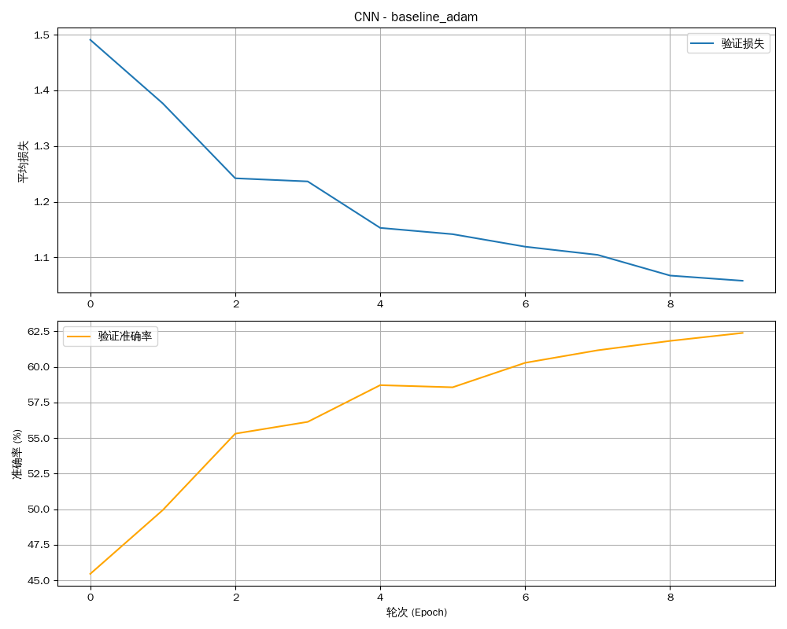
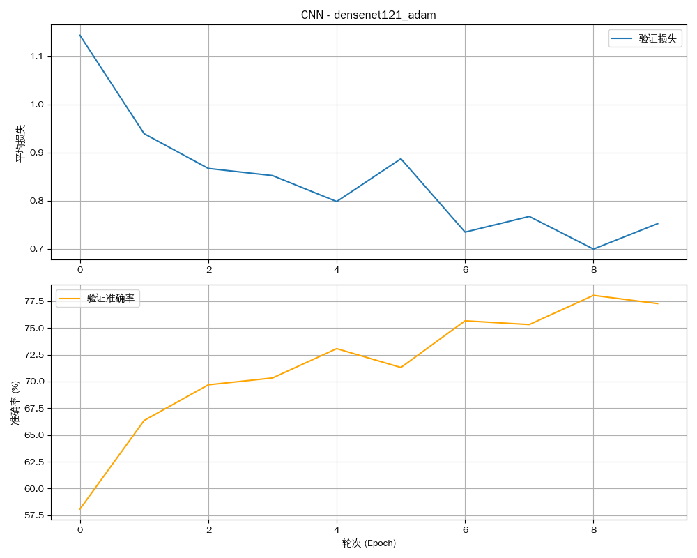
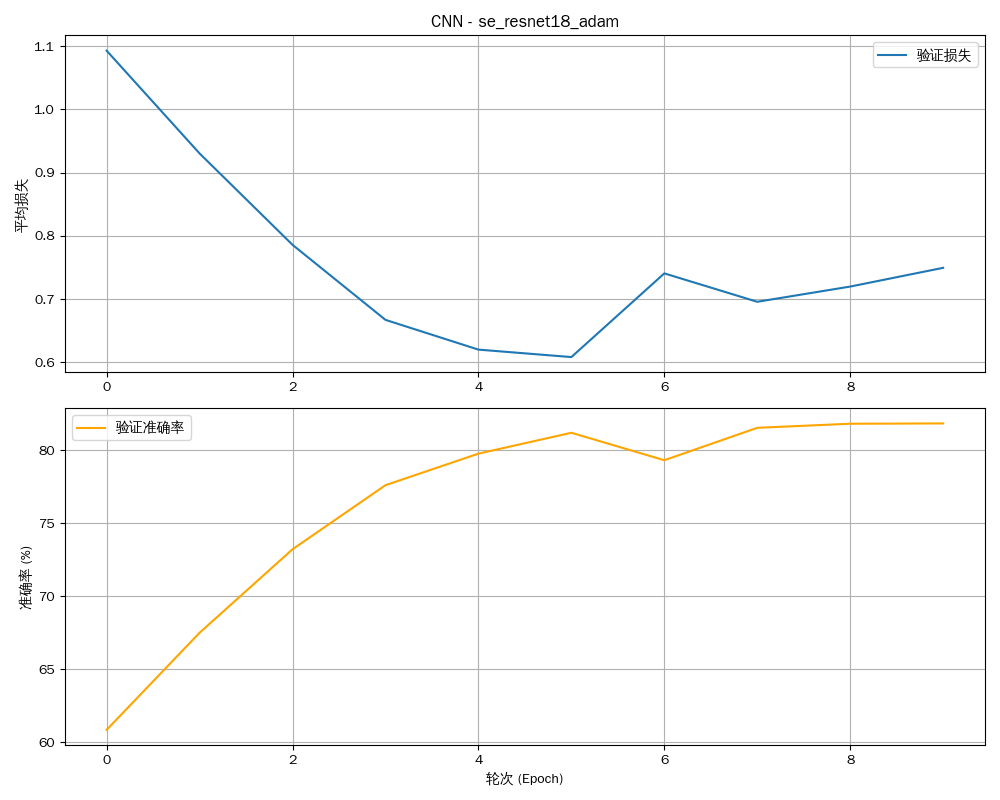

# 实验报告：卷积神经网络（CNN）

**姓名：** 廖望
**学号：** 2210556

---

## 1. 实验概述

### 1.1. 实验目标

本实验的核心目标是在 CIFAR-10 数据集上，通过 PyTorch 框架实现、训练并对比分析多种卷积神经网络（CNN）架构的性能。具体包括：
- 掌握卷积神经网络的基本原理与搭建方法。
- 实现一个基础的CNN模型作为性能基线。
- 实现并对比几种经典的深度CNN架构：**ResNet**、**DenseNet** 以及带有注意力机制的 **SE-ResNet**。
- 通过对比实验，深入理解跳跃连接（Skip Connection）、特征复用和通道注意力机制在解决深度网络训练问题（如梯度消失）中的作用和效果。

### 1.2. 模型架构定义

本实验涉及以下几种核心模型，所有模型均在 `DataParallel` 环境下进行训练。

#### 1.2.1. 基线CNN (`BaselineNet`)
一个简单的前馈卷积网络，作为性能对比的基准。
```
BaselineNet(
  (conv1): Conv2d(3, 6, kernel_size=(5, 5), stride=(1, 1))
  (pool): MaxPool2d(kernel_size=2, stride=2, padding=0, dilation=1, ceil_mode=False)
  (conv2): Conv2d(6, 16, kernel_size=(5, 5), stride=(1, 1))
  (fc1): Linear(in_features=400, out_features=120, bias=True)
  (fc2): Linear(in_features=120, out_features=84, bias=True)
  (fc3): Linear(in_features=84, out_features=10, bias=True)
)
```

#### 1.2.2. ResNet-18
经典的残差网络，通过跳跃连接解决了深度网络的退化问题。
```
ResNet(
  (conv1): Conv2d(3, 64, kernel_size=(3, 3), stride=(1, 1), padding=(1, 1), bias=False)
  (bn1): BatchNorm2d(64, eps=1e-05, momentum=0.1, affine=True, track_running_stats=True)
  (layer1): Sequential(...)
  (layer2): Sequential(...)
  (layer3): Sequential(...)
  (layer4): Sequential(...)
  (linear): Linear(in_features=512, out_features=10, bias=True)
)
```
*注：为简洁起见，此处省略了`layer`内部重复的`BasicBlock`结构。*

#### 1.2.3. DenseNet-121
密集连接网络，通过将每一层与后续所有层连接，实现了极致的特征复用。
```
DenseNet(
  (features): Sequential(
    (conv0): Conv2d(3, 64, kernel_size=(7, 7), stride=(2, 2), padding=(3, 3), bias=False)
    (denseblock1): _DenseBlock(...)
    (transition1): _Transition(...)
    (denseblock2): _DenseBlock(...)
    (transition2): _Transition(...)
    (denseblock3): _DenseBlock(...)
    (transition3): _Transition(...)
    (denseblock4): _DenseBlock(...)
    (norm5): BatchNorm2d(1024, eps=1e-05, momentum=0.1, affine=True, track_running_stats=True)
  )
  (classifier): Linear(in_features=1024, out_features=10, bias=True)
)
```
*注：为简洁起见，此处省略了`_DenseBlock`和`_Transition`内部的详细结构。*

#### 1.2.4. SE-ResNet-18
在 ResNet-18 的基础上，为每个残差块增加了 "Squeeze-and-Excitation" (SE) 注意力模块。
```
ResNet(
  (conv1): Conv2d(3, 64, kernel_size=(3, 3), stride=(1, 1), padding=(1, 1), bias=False)
  (bn1): BatchNorm2d(64, eps=1e-05, momentum=0.1, affine=True, track_running_stats=True)
  (layer1): Sequential((0): SEBasicBlock(...), (1): SEBasicBlock(...))
  (layer2): Sequential((0): SEBasicBlock(...), (1): SEBasicBlock(...))
  (layer3): Sequential((0): SEBasicBlock(...), (1): SEBasicBlock(...))
  (layer4): Sequential((0): SEBasicBlock(...), (1): SEBasicBlock(...))
  (linear): Linear(in_features=512, out_features=10, bias=True)
)
```
*注：`SEBasicBlock` 核心是在 `BasicBlock` 基础上增加了 `SEBlock` 模块。*

---

## 2. 实验结果与综合分析

我们设计了六个实验变种来全面对比不同网络架构和优化策略的性能。

### 2.1. 最终性能汇总

| 实验变种 (`exp_name`)      | 模型架构     | 优化器 | 学习率 | 最终准确率 |
| :------------------------- | :----------- | :----- | :----- | :--------- |
| `cnn_baseline`             | 自定义 CNN   | SGD    | 0.001  | 43%        |
| `cnn_baseline_adam`        | 自定义 CNN   | Adam   | 0.001  | 62%        |
| `cnn_baseline_sgd_high_lr` | 自定义 CNN   | SGD    | 0.01   | 65%        |
| `cnn_densenet121_adam`     | DenseNet-121 | Adam   | 0.001  | 77%        |
| `cnn_se_resnet18_adam`     | SE-ResNet-18 | Adam   | 0.001  | 82%        |
| `cnn_resnet18_adam`        | **ResNet-18**| **Adam**| **0.001**| **82%**    |

### 2.2. 训练过程可视化

| 架构 | 性能曲线 | 架构 | 性能曲线 |
| :--- | :---: | :--- | :---: |
| Baseline CNN |  | ResNet-18 |  |
| DenseNet-121 |  | SE-ResNet-18 |  |

### 2.3. 对比分析

1.  **基线CNN的局限性**:
    - 作为最基础的模型，其性能最差，即使使用Adam优化器和更高的学习率，准确率也仅达到65%，远低于其他高级架构。这表明简单的串联卷积层难以有效学习CIFAR-10这类相对复杂数据集的特征，容易遭遇梯度消失或陷入局部最优。

2.  **ResNet (残差网络) 的有效性**:
    - ResNet-18的性能远超基线模型，最终准确率达到了**82%**。其核心的"跳跃连接"允许梯度直接跨层反向传播，有效解决了网络加深时带来的退化问题，使得训练更深的网络成为可能。

3.  **DenseNet (密集连接网络) 的权衡**:
    - DenseNet将跳跃连接的思想发挥到极致，通过拼接（Concatenation）实现每一层与后续所有层的直接连接，最大化了特征复用。它取得了**77%**的准确率，同样表现出色。与ResNet的元素相加（Addition）相比，DenseNet的参数效率更高，但显存消耗也更大。

4.  **SE-ResNet (注意力机制) 的价值**:
    - SE-ResNet在ResNet的基础上增加了对通道特征进行加权的"Squeeze-and-Excitation"模块，让模型能动态关注信息量最大的特征通道。在本次实验中，SE-ResNet-18的最终准确率与标准ResNet-18持平（均为82%）。这可能是因为CIFAR-10任务相对简单，ResNet-18的性能已接近饱和，注意力机制的优势未能完全展现。理论上，在更复杂的任务中它通常能带来性能提升。

---

## 3. 实验总结

- **跳跃连接是关键**: ResNet和DenseNet的实验结果清晰地证明，跳跃连接是训练深度卷积网络的关键技术。它有效解决了梯度消失问题，使得网络可以从"深度"中真正获益。
- **架构优于调参**: 对于基线CNN，虽然调整优化器和学习率能提升约20%的准确率，但与更换为ResNet/DenseNet架构带来的约40%的提升相比，说明了先进网络架构在解决复杂问题上的根本优势。
- **不同架构范式的对比**: ResNet通过学习残差来简化网络优化，而DenseNet通过特征复用来最大化信息流动。两者都是解决深度网络训练难题的有效范式，在本次实验中ResNet表现略优。
- **注意力机制的潜力**: SE模块为网络赋予了动态选择特征的能力，是一种有效的即插即用增强模块。尽管本次实验效果不明显，但它代表了让网络"学会关注"的重要思想。
