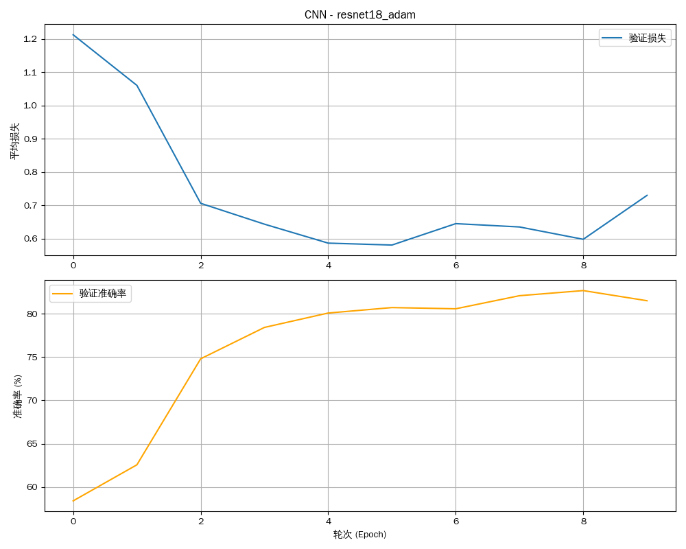

# 实验报告：卷积神经网络（CNN）

**姓名：** 廖望
**学号：** 2210556

[代码仓库](https://github.com/aokimi0/DL)

---

## 1. 实验概述

### 1.1. 实验目标

本实验的核心目标是在 CIFAR-10 数据集上，通过 PyTorch 框架实现、训练并对比分析多种卷积神经网络（CNN）架构的性能。具体包括：
- 掌握卷积神经网络的基本原理与搭建方法。
- 实现一个基础的CNN模型作为性能基线。
- 实现并对比几种经典的深度CNN架构：**ResNet**、**DenseNet** 以及带有注意力机制的 **SE-ResNet**。
- 通过对比实验，深入理解跳跃连接（Skip Connection）、特征复用和通道注意力机制在解决深度网络训练问题（如梯度消失）中的作用和效果。

### 1.2. 模型架构定义

本实验涉及以下几种核心模型，所有模型均在 `DataParallel` 环境下进行训练。

#### 1.2.1. 基线CNN (`BaselineNet`)
一个简单的前馈卷积网络，作为性能对比的基准。
```
BaselineNet(
  (conv1): Conv2d(3, 6, kernel_size=(5, 5), stride=(1, 1))
  (pool): MaxPool2d(kernel_size=2, stride=2, padding=0, dilation=1, ceil_mode=False)
  (conv2): Conv2d(6, 16, kernel_size=(5, 5), stride=(1, 1))
  (fc1): Linear(in_features=400, out_features=120, bias=True)
  (fc2): Linear(in_features=120, out_features=84, bias=True)
  (fc3): Linear(in_features=84, out_features=10, bias=True)
)
```

#### 1.2.2. ResNet-18
经典的残差网络，通过跳跃连接解决了深度网络的退化问题。
```
ResNet(
  (conv1): Conv2d(3, 64, kernel_size=(3, 3), stride=(1, 1), padding=(1, 1), bias=False)
  (bn1): BatchNorm2d(64, eps=1e-05, momentum=0.1, affine=True, track_running_stats=True)
  (layer1): Sequential(...)
  (layer2): Sequential(...)
  (layer3): Sequential(...)
  (layer4): Sequential(...)
  (linear): Linear(in_features=512, out_features=10, bias=True)
)
```
*注：为简洁起见，此处省略了`layer`内部重复的`BasicBlock`结构。*

#### 1.2.3. DenseNet-121
密集连接网络，通过将每一层与后续所有层连接，实现了极致的特征复用。
```
DenseNet(
  (features): Sequential(
    (conv0): Conv2d(3, 64, kernel_size=(7, 7), stride=(2, 2), padding=(3, 3), bias=False)
    (denseblock1): _DenseBlock(...)
    (transition1): _Transition(...)
    (denseblock2): _DenseBlock(...)
    (transition2): _Transition(...)
    (denseblock3): _DenseBlock(...)
    (transition3): _Transition(...)
    (denseblock4): _DenseBlock(...)
    (norm5): BatchNorm2d(1024, eps=1e-05, momentum=0.1, affine=True, track_running_stats=True)
  )
  (classifier): Linear(in_features=1024, out_features=10, bias=True)
)
```
*注：为简洁起见，此处省略了`_DenseBlock`和`_Transition`内部的详细结构。*

#### 1.2.4. SE-ResNet-18
在 ResNet-18 的基础上，为每个残差块增加了 "Squeeze-and-Excitation" (SE) 注意力模块。
```
ResNet(
  (conv1): Conv2d(3, 64, kernel_size=(3, 3), stride=(1, 1), padding=(1, 1), bias=False)
  (bn1): BatchNorm2d(64, eps=1e-05, momentum=0.1, affine=True, track_running_stats=True)
  (layer1): Sequential((0): SEBasicBlock(...), (1): SEBasicBlock(...))
  (layer2): Sequential((0): SEBasicBlock(...), (1): SEBasicBlock(...))
  (layer3): Sequential((0): SEBasicBlock(...), (1): SEBasicBlock(...))
  (layer4): Sequential((0): SEBasicBlock(...), (1): SEBasicBlock(...))
  (linear): Linear(in_features=512, out_features=10, bias=True)
)
```
*注：`SEBasicBlock` 核心是在 `BasicBlock` 基础上增加了 `SEBlock` 模块。*

---

## 2. 实验结果与综合分析

我们设计了六个实验变种来全面对比不同网络架构和优化策略的性能。

### 2.1. 最终性能汇总

| 实验变种 (`exp_name`)      | 模型架构     | 优化器 | 学习率 | 最终准确率 |
| :------------------------- | :----------- | :----- | :----- | :--------- |
| `cnn_baseline`             | 自定义 CNN   | SGD    | 0.001  | 43%        |
| `cnn_baseline_adam`        | 自定义 CNN   | Adam   | 0.001  | 62%        |
| `cnn_baseline_sgd_high_lr` | 自定义 CNN   | SGD    | 0.01   | 65%        |
| `cnn_densenet121_adam`     | DenseNet-121 | Adam   | 0.001  | 77%        |
| `cnn_se_resnet18_adam`     | SE-ResNet-18 | Adam   | 0.001  | 82%        |
| `cnn_resnet18_adam`        | **ResNet-18**| **Adam**| **0.001**| **82%**    |

### 2.2. 训练过程可视化

| 架构 | 性能曲线 | 架构 | 性能曲线 |
| :--- | :---: | :--- | :---: |
| Baseline CNN |  | ResNet-18 |  |
| DenseNet-121 |  | SE-ResNet-18 |  |

### 2.3. 核心架构的训练动态对比分析

本次实验最核心的价值在于揭示了不同网络架构在**训练动态**上的根本性差异。模型的最终性能仅仅是结果，而其训练过程中的表现更能反映架构设计的优劣。

#### 2.3.1. 基线CNN：浅层模型的瓶颈与梯度困境

基线CNN的训练过程是典型的"挣扎"。从性能曲线上看，其准确率的提升缓慢且很早就到达了平台期。这并非简单的参数不足，而是其串联结构的原罪——**梯度消失**。

在反向传播过程中，梯度从损失函数出发，每经过一个卷积层或全连接层，就会与该层的权重矩阵和激活函数的导数相乘。在一个没有"捷径"的深度网络中，这种连乘效应会导致梯度迅速衰减。结果是，靠近输入的底层网络几乎接收不到有效的梯度信号，其参数更新停滞。网络实际上只有靠近输出的少数几层在学习，无法构建出解决复杂问题所需的深层、分级的特征表示。因此，无论如何调整优化器与学习率，其性能上限都被这个结构性缺陷牢牢锁死。

#### 2.3.2. ResNet：残差连接如何"铺平"优化道路

ResNet的性能曲线展现了完全不同的训练动态：稳定、快速且持续的性能提升。其背后的核心是**残差学习**与**跳跃连接**。

ResNet的设计哲学是不直接学习目标映射 `H(x)`，而是学习一个更容易的残差映射 `F(x) = H(x) - x`。这通过跳跃连接（Shortcut Connection）实现，它为梯度提供了一条从高层直达低层的"高速公路"。在训练过程中，梯度可以通过这条恒等映射的路径无损地向前传播，有效绕开了中间权重层的连乘衰减。

这从根本上改变了训练动态：
1.  **保证梯度流通**：确保了即使网络非常深，底层网络也能接收到有效的梯度信号，从而参与到有效的学习中。
2.  **简化学习任务**：在极端情况下，如果恒等映射就是最优解，模型只需将残差部分的权重学习为零即可，这远比学习一个复杂的恒等变换容易。
这使得优化过程变得异常平滑，网络可以轻松地从"深度"中获益，而不是受其所困。

#### 2.3.3. DenseNet：极致的特征复用与梯度分发

DenseNet将ResNet的"捷径"思想推向了极致。它不是通过"加法"合并特征，而是通过"拼接"（Concatenation）将每一层与所有后续层直接连接。这种设计带来了独特的训练动态，可概括为**极致的特征复用**与**密集的梯度分发**。

在训练时，任何一层都能直接接收到来自损失函数以及所有其前序层级的梯度信号，这带来了两个显著优势：
1.  **隐式的深度监督**：由于梯度路径极短，网络中的每一层都受到了更直接的监督，极大地缓解了梯度消失问题。
2.  **鼓励特征创新**：由于模型知道旧的特征图谱会被一直保留和传递，它会倾向于学习新的、补充性的特征，而不是冗余的特征。这使得DenseNet在参数效率上非常高，可以用更少的参数达到与ResNet相当甚至更好的性能。

从性能曲线上看，DenseNet同样表现出高效的训练过程。但其代价是巨大的显存消耗，因为每一层都需要拼接前面所有层的特征图，导致特征图谱的通道数迅速增长。

#### 2.3.4. SE-ResNet：引入"注意力"的动态学习过程

SE-ResNet在ResNet的基础上，引入了"Squeeze-and-Excitation"模块，为训练过程增添了**动态通道注意力机制**。

其训练动态的独特性在于，模型不仅要学习如何通过卷积核提取空间特征，还要**并行的学习如何根据当前输入，为不同特征通道分配权重**。这个过程分为两步：
1.  **Squeeze**：全局池化，为每个通道生成一个描述符，即"看清"每个通道的全局信息。
2.  **Excitation**：通过一个微型全连接网络，学习通道间的复杂依赖，并输出一组权重，即"决定"哪些通道更重要。

这意味着SE-ResNet的学习是**动态和自适应的**。它学会了"关注"信息量大的特征，抑制噪声或冗余特征。虽然在CIFAR-10这个相对简单的任务上，其最终性能与ResNet-18持平，但这并不意味着注意力机制无效。更可能的原因是，ResNet-18的特征提取能力已接近饱和，通道间的复杂依赖并非性能瓶颈。在更具挑战性的数据集上，这种动态调整资源分配的能力通常会带来显著的性能提升。

---

## 3. 实验总结

通过本次实验，我们不仅验证了不同CNN架构的性能，更重要的是洞察了其架构设计如何深刻影响训练过程。

- **从"无法训练"到"有效训练"：跳跃连接是关键**
  基线CNN与ResNet/DenseNet的对比雄辩地证明，跳跃连接是现代深度学习的基石。它将深度网络的训练从与梯度消失的"搏斗"，转变为一个稳定、可控的优化过程，是实现"深度"带来"红利"的前提。

- **两种"捷径"的范式之争：ResNet的加法 vs. DenseNet的拼接**
  ResNet的残差学习通过"加法"提供了一条简洁高效的梯度高速路。而DenseNet的密集连接则通过"拼接"实现了极致的特征复用和参数效率。二者代表了解决深度训练难题的两种不同哲学，前者在实现和显存上更具优势，后者则在参数效率上更胜一筹。

- **从"静态结构"到"动态关注"：注意力机制的启示**
  SE-ResNet的引入，标志着模型设计从"静态的、一视同仁的"特征提取，向"动态的、有选择性的"信息处理的演进。在训练中教会模型"应该关注什么"，是提升模型智能和效率的重要方向。尽管在本次实验中效果不显著，但它所代表的"元学习"（学习如何学习）思想，是通往更强大人工智能模型的必经之路。
