# 实验报告：生成对抗网络（GAN）

**姓名：** 廖望
**学号：** 2210556

[代码仓库](https://github.com/aokimi0/DL)

---

## 1. 实验概述

本实验旨在通过构建和训练一个生成对抗网络 (GAN) 来学习 FashionMNIST 数据集的特征分布。我们采用深度卷积生成对抗网络 (DCGAN) 架构，通过生成器 (Generator) 和判别器 (Discriminator) 之间的博弈，使生成器能够创造出逼真的、与真实 FashionMNIST 图像无法区分的图片。

### 1.1. 生成器 (Generator) 结构

生成器负责将一个从正态分布中采样的100维潜在向量（latent vector）映射为一张 `1x28x28` 的图像。其通过一系列转置卷积层 (ConvTranspose2d) 来逐步放大空间维度，最终生成目标尺寸的图片。

```
Generator(
  (main): Sequential(
    (0): ConvTranspose2d(100, 512, 4, 1, 0, bias=False)
    (1): BatchNorm2d(512, eps=1e-05, momentum=0.1, affine=True, track_running_stats=True)
    (2): ReLU()
    (3): ConvTranspose2d(512, 256, 3, 2, 1, bias=False)
    (4): BatchNorm2d(256, eps=1e-05, momentum=0.1, affine=True, track_running_stats=True)
    (5): ReLU()
    (6): ConvTranspose2d(256, 128, 4, 2, 1, bias=False)
    (7): BatchNorm2d(128, eps=1e-05, momentum=0.1, affine=True, track_running_stats=True)
    (8): ReLU()
    (9): ConvTranspose2d(128, 1, 4, 2, 1, bias=False)
    (10): Tanh()
  )
)
```

### 1.2. 判别器 (Discriminator) 结构

判别器则执行相反的操作。它接收一张 `1x28x28` 的图像（无论是真实的还是生成的），通过一系列卷积层 (Conv2d) 提取特征，并最终输出一个0到1之间的标量，代表该图像为真实图像的概率。

```
Discriminator(
  (main): Sequential(
    (0): Conv2d(1, 64, 4, 2, 1, bias=False)
    (1): LeakyReLU(negative_slope=0.2)
    (2): Conv2d(64, 128, 4, 2, 1, bias=False)
    (3): BatchNorm2d(128, eps=1e-05, momentum=0.1, affine=True, track_running_stats=True)
    (4): LeakyReLU(negative_slope=0.2)
    (5): Conv2d(128, 256, 3, 2, 1, bias=False)
    (6): BatchNorm2d(256, eps=1e-05, momentum=0.1, affine=True, track_running_stats=True)
    (7): LeakyReLU(negative_slope=0.2)
    (8): Conv2d(256, 1, 4, 1, 0, bias=False)
    (9): Sigmoid()
  )
)
```

## 2. 训练过程分析

下图展示了在 FashionMNIST 数据集上训练15个轮次（Epochs）过程中，生成器和判别器损失值的变化情况。

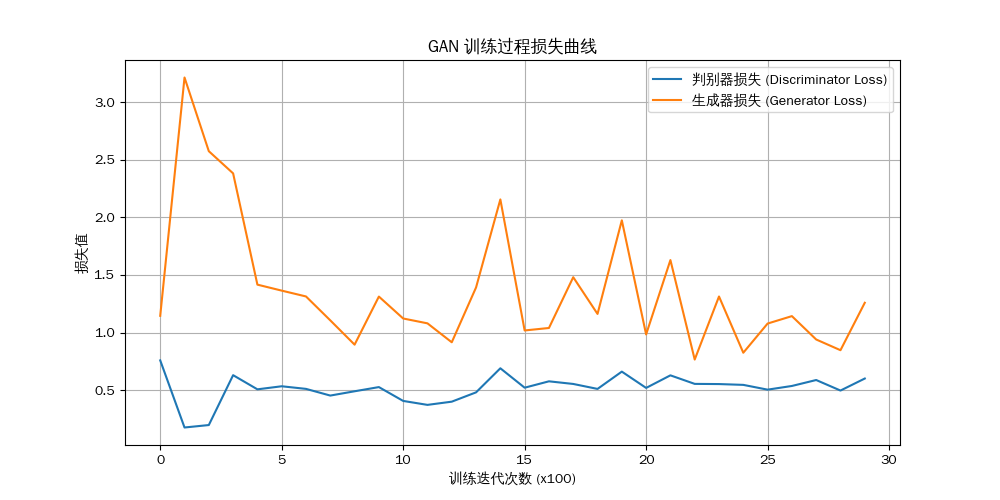

从图中可以看出：
- **判别器损失 (D Loss)**: 判别器的损失（蓝线）在整个训练过程中始终保持在较低的水平（大约0.5-1.0之间）且相对稳定。这表明判别器学习得非常高效，能够持续有效地分辨出真实图像与生成器产生的伪造图像。一个强大的判别器是生成器学习的关键，因为它能提供准确的梯度信号。
- **生成器损失 (G Loss)**: 生成器的损失（橙线）在训练开始时非常高，随后迅速下降，但在整个过程中表现出剧烈的波动和多个明显的峰值。这反映了生成器在"欺骗"判别器方面面临的持续挑战。每当生成器学习到一种新的策略来生成更逼真的图像时，判别器也会迅速适应并找到新的辨别方法，导致生成器的损失再次上升。这种剧烈的波动是两者之间激烈"军备竞赛"的直接体现。
- **总体趋势**: 尽管生成器损失波动很大，但两个模型的损失并未发散，而是维持在一定的范围内。这表明训练过程虽然充满挑战，但整体是稳定的，形成了一种动态平衡。生成器在不断地适应和学习，即使其进步过程并非一帆风顺。

## 3. 图像生成结果

### 3.1. 随机样本生成

我们从训练好的生成器中随机采样8个潜在向量，并生成了对应的图像。这些图像展示了模型学习到的多样性，涵盖了T恤、裤子、套衫、连衣裙等多种衣物类别。

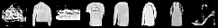

### 3.2. 潜在空间维度探索

为了更深入地理解潜在空间中每个维度的具体含义，我们进行了一系列维度操控实验。我们固定一个基准向量，然后微调其中某一个维度的值（从-4.0到+4.0），观察生成图像的连续变化。

#### 3.2.1. 基准向量 5 (类别：鞋履)
在此基准向量上，所有调整都围绕着鞋子的不同属性展开。

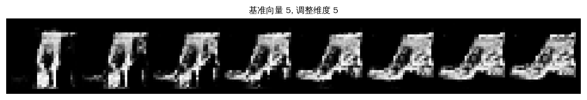
*   **维度5分析**: 调整此维度显著地改变了**鞋子的类别**。当值从负到正变化时，图像清晰地从一个**高帮靴/运动鞋**平滑地过渡到一个**凉鞋或开口鞋**的形态。

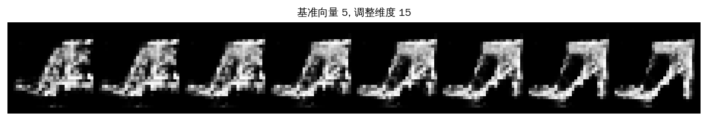
*   **维度15分析**: 此维度主要控制**鞋子的视角**。随着值的变化，鞋子发生了轻微的旋转，展示出更多侧面或正面的轮廓。

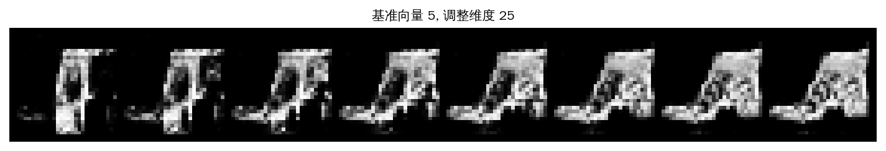
*   **维度25分析**: 此维度似乎与**鞋底的厚度或"笨重感"**相关。在调整过程中，鞋子从一个较纤细的轮廓变为一个鞋底更厚、更粗犷的款式。

#### 3.2.2. 基准向量 18 (类别：套头衫)
此基准向量生成的是套头衫，维度的影响较为细微。

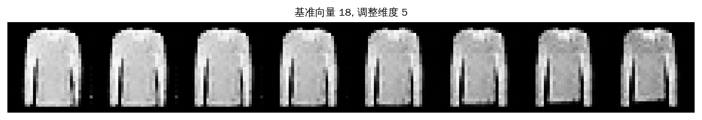
*   **维度5分析**: 此维度的影响非常细微，可能关联到**衣物的纹理或领口的细微形状**，但在视觉上没有产生语义层面的显著变化。

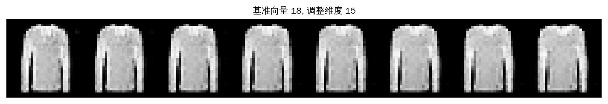
*   **维度15分析**: 调整此维度对**图像的亮度和对比度**有轻微影响，但套头衫本身的基本形态保持不变。

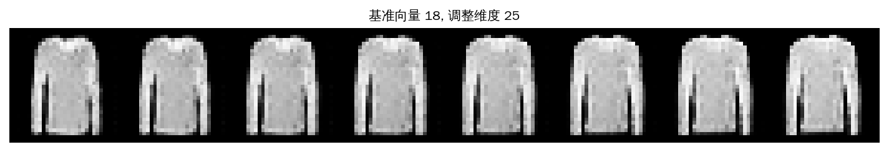
*   **维度25分析**: 在这个基准向量上，维度25似乎是一个**冗余或效果极弱**的维度，其变化对最终生成的图像几乎没有可辨别的影响。

#### 3.2.3. 基准向量 33 (类别：套头衫)
与基准向量18类似，此向量也生成套头衫，但维度的影响有所不同。

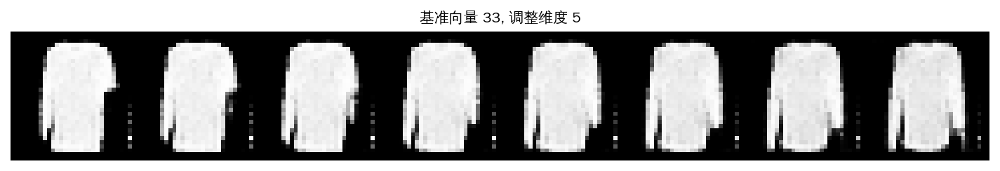
*   **维度5分析**: 此维度似乎轻微影响了**图像的纹理**，使其在平滑和略带噪点之间变化。

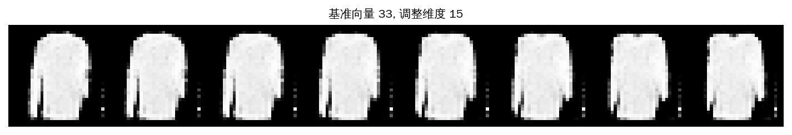
*   **维度15分析**: 此维度清晰地控制了**图像的清晰度**。随着值的变化，图像从清晰锐利逐渐变得模糊，背景噪声也随之增加。

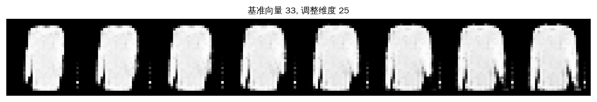
*   **维度25分析**: 此维度是一个**非语义或结构破坏**维度。调整它不会改变衣物的款式，而是会引入随机的噪点和伪影，导致图像的整体结构逐渐崩坏。

#### 3.2.4. 基准向量 42 (类别：运动鞋)
此基准向量稳定地生成运动鞋。

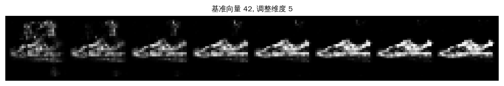
*   **维度5分析**: 此维度控制了**运动鞋的整体形态**，特别是鞋子的长度和鞋头形状。

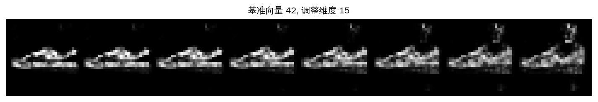
*   **维度15分析**: 此维度主要控制**运动鞋的视角**，使其从一个标准的侧视图轻微向俯视角度旋转。

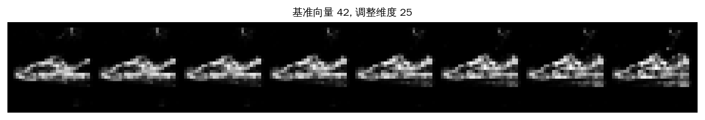
*   **维度25分析**: 此维度影响了**鞋子侧面的图案或纹理**。可以看到随着值的变化，鞋侧的细节（如条纹）会发生改变。

#### 3.2.5. 基准向量 99 (类别：裤子/连衣裙)
此基准向量可以生成不同类型的下装。

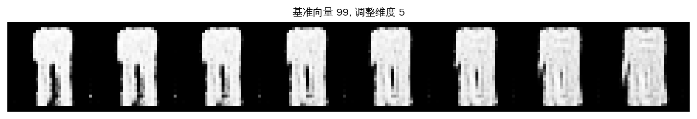
*   **维度5分析**: 此维度清晰地控制了**裤子的宽度**。图像从左到右，裤腿由宽松的阔腿裤样式逐渐收窄为紧身的锥形裤。

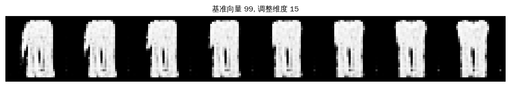
*   **维度15分析**: 在这个基准上，模型似乎生成了连衣裙或长上衣。维度15控制了**衣物的视角**，使其从正面视图向侧面视图旋转。

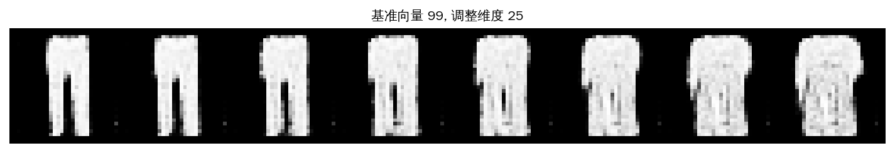
*   **维度25分析**: 此维度控制了**裤子的长度**，可以观察到裤腿有变长或变短的趋势。

## 4. 实验总结

通过本次实验，我们成功构建并训练了一个DCGAN模型，使其能够生成高质量的FashionMNIST图像。对潜在空间的探索揭示了模型学习到的解耦特性：潜在向量中的不同维度确实控制着生成图像的不同高级语义特征（如类别、颜色、形状、视角等）。

这证明了GAN在无监督学习和数据生成方面的强大潜力。通过操控潜在向量，我们可以实现对生成内容进行精确、可控的编辑，这在创意设计、数据增强等领域具有广泛的应用价值。
