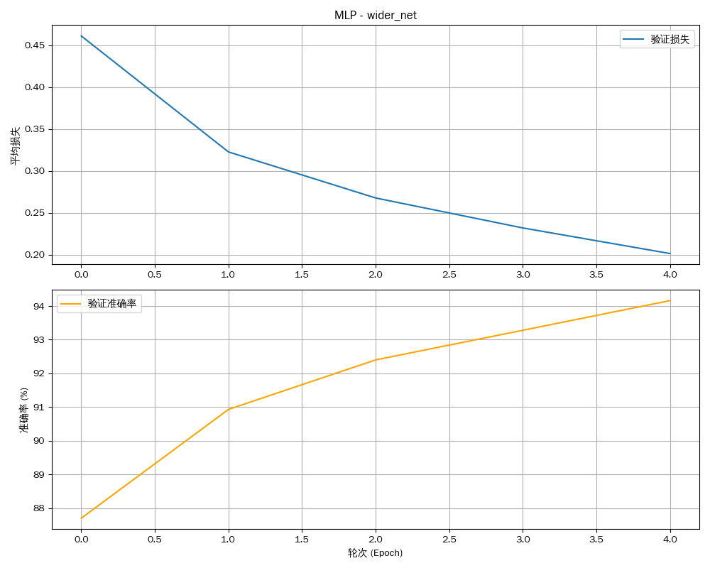
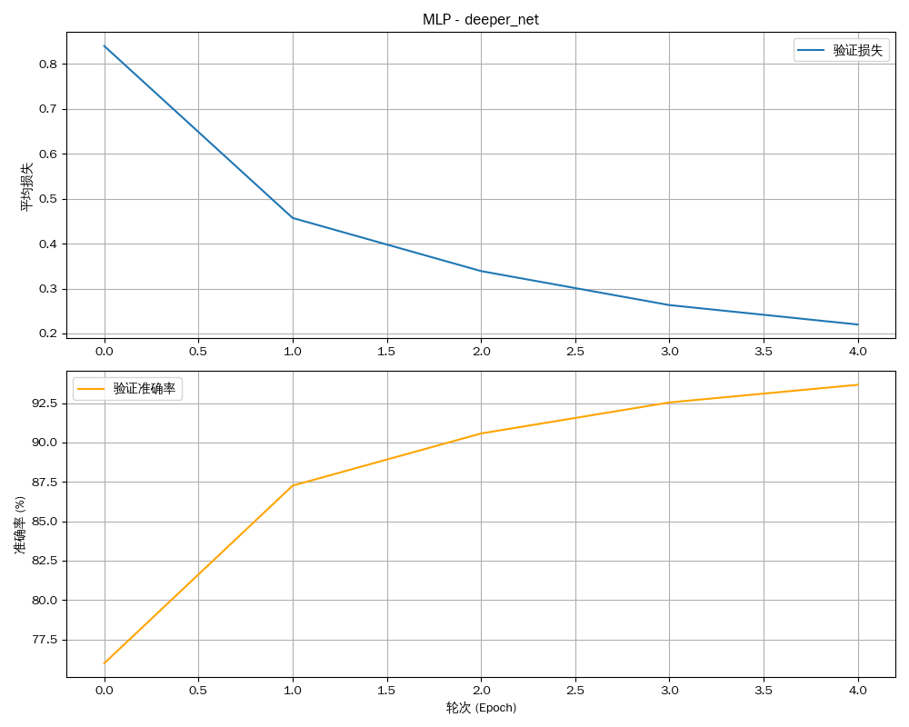

# 实验报告：多层感知机（MLP）与 MLP-Mixer

**姓名：** 廖望
**学号：** 2210556

[代码仓库](https://github.com/aokimi0/DL)

---

## 1. 实验概述

### 1.1. 实验目标

本实验旨在基于 PyTorch 框架，在经典的 MNIST 数据集上构建、训练并系统性评估多层感知机（MLP）模型。核心目标聚焦于：

- 掌握构建 MLP 模型的核心流程，包括网络结构定义、数据加载、训练循环与性能评估。
- 探索关键超参数，特别是网络结构（宽度与深度）和优化算法（SGD vs. Adam），对模型最终性能的影响。
- (加分项) 实现并评估一个更现代的、基于 MLP 架构的视觉模型 MLP-Mixer，并与传统 MLP 进行性能对比。

### 1.2. 实验设计

为系统性地评估不同因素对模型性能的影响，我们设计了以下实验变种：

- **传统 MLP 对比实验**:
    - **基线模型 (`baseline`)**:
        - 网络结构: `[784 -> 128 -> 64 -> 10]`
        - 优化器: SGD, 学习率 `0.01`
    - **更深的网络 (`deeper_net`)**: 在基线模型上增加一个隐藏层 `[784 -> 128 -> 64 -> 32 -> 10]`。
    - **更宽的网络 (`wider_net`)**: 在基线模型上加宽隐藏层 `[784 -> 256 -> 128 -> 10]`。
    - **Adam 优化器 (`adam_optimizer`)**: 将基线模型的优化器更换为 Adam (学习率 `0.001`)。
- **MLP-Mixer 实验 (`mixer_baseline`)**:
    - **核心思想**: 实现一种完全基于 MLP 的现代视觉架构，不使用卷积或自注意力机制。
    - **优化器**: AdamW, 学习率 `1e-3`

所有实验均在 **MNIST** 数据集上进行，该数据集包含60,000张训练图像和10,000张测试图像（28x28像素灰度图）。

---

## 2. 传统 MLP 实验分析

### 2.1. 性能指标汇总

下表汇总了四个传统 MLP 模型变种在 MNIST 测试集上取得的最终性能。

| 实验变种 (`exp_name`) | 最终测试损失 | 最终测试准确率 |
| :--- | :---: | :---: |
| `baseline` | 0.2033 | 94.03% |
| `wider_net` | 0.2015 | 94.16% |
| `deeper_net` | 0.2200 | 93.66% |
| `adam_optimizer` | **0.0842** | **97.44%** |

### 2.2. 训练过程与分析

| 实验变种 (`exp_name`) | 性能曲线图 |
| :--- | :---: |
| `baseline` |  |
| `wider_net` |  |
| `deeper_net` |  |
| `adam_optimizer` |  |

#### **数据驱动的分析:**

1.  **模型容量的影响**:
    - 从数据上看，`wider_net` (94.16%) 相较于 `baseline` (94.03%) 准确率有轻微提升。
    - 然而，`deeper_net` (93.66%) 的表现反而不如基线模型。这可能说明在仅有 5 个训练轮次的情况下，更深的网络没有足够的时间来有效学习。在当前设定下，**加宽网络是比加深网络更优的策略**。

2.  **优化器的影响**:
    - **Adam 优化器的效果是压倒性的**。`adam_optimizer` 变种的准确率达到了 **97.44%**，比使用 SGD 的基线模型高出 **3.41%**，并且其最终损失 (0.0842) 远低于所有 SGD 变种。
    - 从图中可见，Adam 的收敛速度显著快于 SGD，证明了其自适应学习率机制在本任务中的优越性。

---

## 3. MLP-Mixer 实验分析

MLP-Mixer 是一种完全基于多层感知器（MLP）的现代计算机视觉架构。它将图像分割成多个"图块"（Patches），然后交替应用在图块间混合信息（Token-Mixing）的 MLP 和在图块内混合信息（Channel-Mixing）的 MLP。

| 最终测试损失 | 最终测试准确率 |
| :---: | :---: |
| **0.0775** | **97.71%** |

#### **结果分析:**

- **超越传统 MLP**: `mixer_baseline` 实验取得了 **97.71%** 的惊人准确率和 **0.0775** 的低损失。这一结果不仅优于所有传统 MLP 变种，甚至超越了使用 Adam 优化器的最佳 MLP 模型 (`adam_optimizer`, 97.44%)。
- **架构的力量**: MLP-Mixer 的成功证明，通过巧妙的架构设计，纯粹的 MLP 结构也能够达到与卷积网络相媲美的强大性能。它有效地捕捉了图像中的空间信息，但方式与 CNN 完全不同。
- **收敛性**: 从性能曲线上看，MLP-Mixer 的训练过程非常稳定，损失稳步下降，准确率平稳上升，展示了该架构良好的训练特性。

---

## 4. 实验总结

本次系列实验提供了丰富的洞见：

1.  **优化器是关键**: 对于传统 MLP，选择 Adam 优化器比调整网络结构的宽度或深度带来了更为显著的性能提升。
2.  **简单调优的局限性**: 简单地加深网络（在训练轮次不足时）可能反而会损害性能。模型容量的提升需要与训练策略相匹配。
3.  **架构创新是根本**: MLP-Mixer 作为加分项，其优异表现雄辩地证明了**架构创新比单纯的参数调优更具潜力**。它以一种全新的范式挑战了卷积在视觉领域的主导地位，并取得了卓越的成果，为我们提供了解决视觉问题的全新思路。
