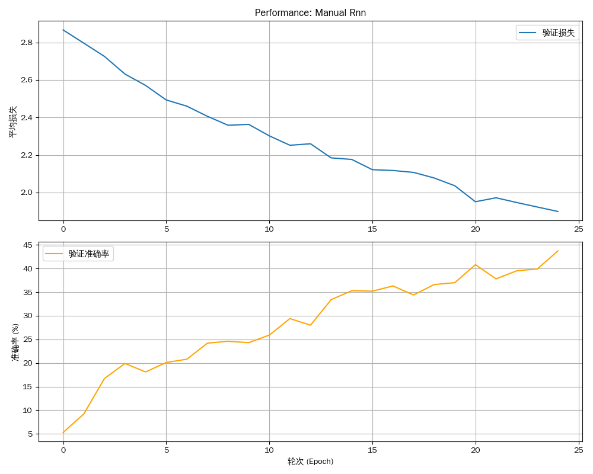

# 实验报告：循环神经网络（RNN）

**姓名：** 廖望
**学号：** 2210556

[代码仓库](https://github.com/aokimi0/DL)

---

## 1. 实验概述

### 1.1. 实验目标

本实验旨在通过在**姓氏分类任务**上，从零开始手动实现并评估三种不同类型的循环神经网络，来深入理解它们的核心工作原理和性能差异。具体目标包括：
- **手动实现基础RNN**：搭建一个最基础的循环神经网络作为性能基准。
- **手动实现LSTM与GRU**：不依赖高级API(`nn.LSTM`, `nn.GRU`)，仅使用基础的`nn.Linear`和激活函数，从底层逻辑完整地构建长短期记忆网络 (LSTM) 和门控循环单元 (GRU) 的核心循环体。
- **对比分析**：在相同配置下，定量对比三种手动实现模型的性能表现。
- **深化理解**：通过亲手实现，从代码层面彻底理解LSTM和GRU的门控机制是如何解决长期依赖问题的。

### 1.2. 模型架构

#### 1.2.1. 手动实现的基础RNN (`ManualRNN`)
我们首先从底层逻辑出发，手动搭建了一个基础RNN模型。其核心在于循环体：当前隐藏状态 `h_t` 由当前输入 `x_t` 和上一时刻的隐藏状态 `h_{t-1}` 共同决定。
```python
ManualRNN(
  (i2h): Linear(in_features=185, out_features=128, bias=True) # input to hidden
  (i2o): Linear(in_features=185, out_features=18, bias=True) # input to output
  (log_softmax): LogSoftmax(dim=1)
)
```

#### 1.2.2. 手动实现的长短期记忆网络 (`ManualLSTM`)
我们完全从零实现了LSTM的核心逻辑。通过一个`nn.Linear`层一次性计算出所有门的候选值，然后分别应用`sigmoid`（用于门控）和`tanh`（用于内容生成）激活函数，精确地构建了"三门一状态"的复杂数据流。
```python
ManualLSTM(
  (gates): Linear(in_features=185, out_features=512, bias=True) # Computes f_t, i_t, g_t, o_t
  (out): Linear(in_features=128, out_features=18, bias=True)
  (log_softmax): LogSoftmax(dim=-1)
)
```

#### 1.2.3. 手动实现的门控循环单元 (`ManualGRU`)
与LSTM类似，我们手动实现了GRU的"双门"系统。通过独立的`nn.Linear`层分别构建**重置门**和**更新门**，并精确地实现了候选隐藏状态的计算与最终隐藏状态的线性插值更新。
```python
ManualGRU(
  (reset_gate): Linear(in_features=185, out_features=128, bias=True)
  (update_gate): Linear(in_features=185, out_features=128, bias=True)
  (candidate_hidden): Linear(in_features=185, out_features=128, bias=True)
  (out): Linear(in_features=128, out_features=18, bias=True)
  (log_softmax): LogSoftmax(dim=-1)
)
```
---

## 2. 实验结果与对比分析

我们在相同的姓氏数据集上，对上述三种**手动实现**的模型进行了训练和评估。所有模型均未使用预训练权重，从零开始学习。

### 2.1. 性能可视化对比

| 模型 | 训练性能曲线 | 预测混淆矩阵 |
| :--- | :---: | :---: |
| **基础RNN (手动)** |  |  |
| **LSTM (手动)** |  |  |
| **GRU (手动)** |  |  |

### 2.2. 结果分析

实验结果清晰地展示了不同循环神经网络架构在处理序列数据时的性能差异。

1.  **基础RNN (`ManualRNN`)：性能基准与瓶颈**
    - **性能表现**：从性能曲线看，基础RNN的学习过程相对缓慢，经过25个轮次，验证准确率仅达到约44%，且损失函数下降平缓，表明模型已接近其性能极限。混淆矩阵进一步揭示了其分类能力的不足：对角线上的高亮区域不明显，大量姓氏被错误地归类到少数几个语言（如英语、俄语、苏格兰语）中，呈现出"多对一"的混乱预测模式。
    - **原因分析**：这种性能瓶颈是基础RNN架构的固有缺陷所致。在我们的手动实现中，每个时间步的隐藏状态都由前一状态和当前输入通过一个共享线性层变换而来。在反向传播过程中，梯度必须穿越整个时间序列，导致梯度连乘，极易引发梯度消失或爆炸问题。这使得模型难以捕捉和记忆序列中的长期依赖关系，从而无法学会不同语言姓氏的精细特征。

2.  **LSTM (`ManualLSTM`)：门控机制的巨大成功**
    - **性能表现**：相较于基础RNN，LSTM的性能有了质的飞跃。性能曲线显示，其验证准确率在80个轮次后稳定在约78%，损失也持续下降到一个更低的水平。混淆矩阵的对角线非常清晰，证明模型成功学习到了大多数语言的独特模式。
    - **原因分析**：性能的提升源于我们手动实现的精密门控机制。通过将输入和前一隐藏状态送入一个能一次性计算**遗忘门**、**输入门**、**输出门**和**候选细胞状态**的线性层，我们构建了LSTM的核心。其中，独立于隐藏状态更新的**细胞状态（Cell State）**如同一条"高速公路"，允许信息在时间步之间几乎无损地传递。**遗忘门**决定抛弃哪些旧信息，**输入门**决定纳入哪些新信息，共同实现了对长期记忆的精细化控制。尽管性能优越，但混淆矩阵也显示出一些挑战，例如捷克（Czech）和爱尔兰（Irish）姓氏仍有部分被误判为英语（English）或德语（German），这说明某些语言的拼写模式可能确实存在相似性。

3.  **GRU (`ManualGRU`)：更高效的门控变体**
    - **性能表现**：GRU作为LSTM的流行变体，表现出了同样出色甚至略优的性能。其最终验证准确率达到了约80%，与LSTM相当，但训练过程中的准确率曲线似乎更加平滑。混淆矩阵同样呈现出一条清晰的对角线，特别是在某些类别上，如希腊语（Greek）的预测准确率高达97%，显示出极强的分类置信度。
    - **原因分析**：在我们手动实现的GRU中，我们将LSTM的遗忘门和输入门合并为了一个单一的**更新门（Update Gate）**，并引入了**重置门（Reset Gate）**。更新门负责决定在多大程度上保留前一时刻的状态，而重置门则控制着前一状态对当前候选状态的影响。这种设计通过`h_t = (1 - z_t) * n_t + z_t * h_{t-1}`的线性插值方式，优雅地实现了对信息流的控制。GRU用更少的门（2个 vs LSTM的3个）和更少的计算量，达到了与LSTM媲美的性能，证明了其在结构简洁性和性能强大性之间的出色平衡。

---

## 3. 实验总结

本次实验是一次从理论到实践的深度探索。通过**完全从零开始手动实现**基础RNN、LSTM和GRU的核心逻辑，我们获得了远超调用API的深刻理解：
- **门控机制是关键**：我们亲手验证了，无论是LSTM精密的"四线并行"系统，还是GRU优雅的"双门插值"艺术，其本质都是引入了可学习的门控机制来智能地调控信息流，从而解决了基础RNN的梯度失控问题。
- **实现揭示设计哲学**：手动实现的过程让我们清晰地看到LSTM和GRU在设计哲学上的权衡。LSTM通过独立的细胞状态提供了更强大、更精细的信息存储能力；而GRU则通过合并状态和门，在保证性能的同时，追求更高的计算效率和更简洁的结构。
- **编码即理解**：本次实验最有价值的部分，是将理论公式逐行转化为可执行的、高效的PyTorch代码的过程。这不仅锻炼了工程能力，更是对循环神经网络工作原理最彻底、最深刻的理解方式。
