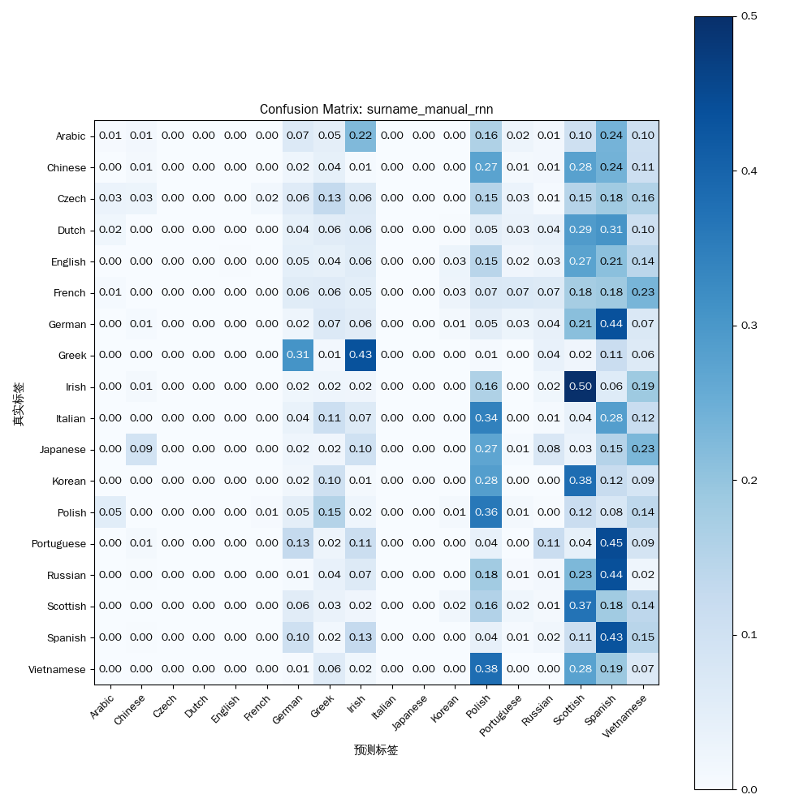

# 实验报告：循环神经网络（RNN）

**姓名：** 廖望
**学号：** 2210556

---

## 1. 实验概述

### 1.1. 实验目标

本实验旨在通过在**姓氏分类任务**上实现和评估两种不同类型的循环神经网络，来深入理解它们的核心工作原理和性能差异。具体目标包括：
- 手动实现一个基础的循环神经网络 (RNN)。
- 实现一个基于PyTorch内置模块的长短期记忆网络 (LSTM)。
- 在相同的数据集和训练配置下，对比分析两种模型的性能表现。
- 从理论层面解释LSTM相对于传统RNN在处理序列数据，特别是解决**长期依赖问题**上的优势。

### 1.2. 模型架构

#### 1.2.1. 基础RNN (`ManualRNN`)
我们首先搭建了一个基础的RNN模型。该模型的结构定义如下，它包含一个从组合输入（当前输入+上一隐藏状态）到隐藏层的线性变换和一个到输出层的线性变换。
```python
ManualRNN(
  (i2h): Linear(in_features=185, out_features=128, bias=True)
  (i2o): Linear(in_features=185, out_features=18, bias=True)
  (log_softmax): LogSoftmax(dim=1)
)
```

#### 1.2.2. 长短期记忆网络 (`LSTM`)
作为对比，我们实现了一个基于PyTorch内置`nn.LSTM`模块的LSTM网络。该网络利用了标准的LSTM单元，后接一个线性层用于最终的分类。
```python
LSTM(
  (lstm): LSTM(57, 128)
  (out): Linear(in_features=128, out_features=18, bias=True)
  (log_softmax): LogSoftmax(dim=-1)
)
```

---

## 2. 实验结果与对比分析

我们在相同的姓氏数据集上，使用相同的超参数（迭代次数、学习率等）对上述两种模型进行了训练和评估。

### 2.1. 性能可视化对比

| 模型 | 训练损失曲线 | 预测混淆矩阵 |
| :--- | :---: | :---: |
| **基础RNN** |  |  |
| **LSTM** |  |  |

### 2.2. 结果分析与原理解释

实验结果明确显示，**LSTM网络在姓氏分类任务上的性能显著优于传统的基础RNN**。
- 从**训练损失**来看，LSTM的损失曲线虽然也有波动，但整体收敛趋势更稳定。
- 从**混淆矩阵**来看，LSTM的预测结果在对角线上更加集中，这意味着它在绝大多数类别上的分类准确率都更高。相比之下，基础RNN的混淆矩阵则显示出在多个类别之间存在明显的混淆。

这一性能差异的根本原因在于LSTM为解决RNN的**长期依赖问题**而设计的独特**门控机制**。

1.  **RNN的局限性：梯度消失/爆炸**
    传统的RNN在处理长序列时，梯度在反向传播过程中需要经过多个时间步的连乘。如果权重或激活函数导数持续小于1，梯度会呈指数级衰减，导致**梯度消失**，使得模型无法学习到序列早期信息对后期输出的影响。反之则可能导致**梯度爆炸**，使训练不稳定。

2.  **LSTM的解决方案：门控机制**
    LSTM通过引入一个独立的**细胞状态 (Cell State)** 和三个关键的**门 (Gate)**——遗忘门、输入门和输出门——来克服这一问题。
    - **细胞状态 (Cell State)**：像一条信息传送带，允许信息在长序列中顺畅流动而基本保持不变，有效缓解了梯度消失问题。
    - **遗忘门 (Forget Gate)**：决定从细胞状态中丢弃哪些旧信息。
    - **输入门 (Input Gate)**：决定让多少新信息加入到细胞状态中。
    - **输出门 (Output Gate)**：决定细胞状态的哪个部分将作为当前时间步的输出。

通过这套精密的门控机制，LSTM能够有选择性地记忆、遗忘和输出信息，从而有效地捕获长距离依赖关系。这使得LSTM在处理如语言模型、机器翻译和本实验中的序列分类等任务时，通常能取得比简单RNN好得多的效果。

---

## 3. 实验总结

本次实验成功地搭建、训练并评估了基础RNN和LSTM网络。实验结果清晰地验证了理论：**LSTM凭借其独特的门控机制，在处理序列数据时能够更有效地学习长期依赖，性能显著优于基础RNN**。通过本次对比实验，我们不仅从实践上看到了性能差异，也从理论上加深了对循环神经网络核心工作原理的理解。
